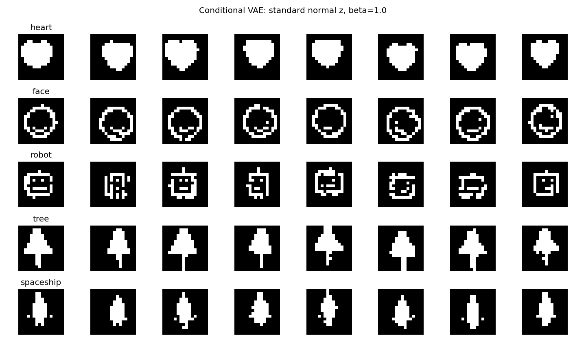

# Tiny Black-and-White Generative AI

A deliberately minimal text-to-image generative AI project for teaching beginners.

[](https://colab.research.google.com/github/dujing82-blip/tiny-black-white-generative-ai/blob/main/Tiny_Black_White_Generative_AI.ipynb)

## The entire idea

```text
WORD + RANDOM z  →  DECODER  →  16×16 BLACK-AND-WHITE IMAGE
```

The model knows only five words:

**heart · face · robot · tree · spaceship**

There are no colors and no sizes. This keeps the code and the conceptual story as direct as possible.


## Version 2: CNN-VAE for better generation

Students who already know CNNs can use the improved CNN-VAE notebook:

[](https://colab.research.google.com/github/dujing82-blip/tiny-black-white-generative-ai/blob/main/V2_CNN_VAE_Better_Generation.ipynb)

V2 keeps the same VAE concept but uses a convolutional encoder and decoder, 10,000 training images, an 8-dimensional latent space, Binary Crossentropy reconstruction loss, and standard VAE KL weighting (beta = 1.0 with reconstruction summed over pixels).

The CNN conditional notebook uses enough KL regularization to keep training latent distributions near the standard normal distribution used for new samples. The earlier beta = 0.005 configuration could reconstruct training icons while producing poor icons from random z. Soft/binary comparisons now reuse the same latent samples through a fixed seed.

Actual examples generated after 40 training epochs (five rows: heart, face, robot, tree, spaceship):



## Pure VAE: generate an icon from two numbers

[](https://colab.research.google.com/github/dujing82-blip/tiny-black-white-generative-ai/blob/main/Pure_VAE_2D_Icon_Generator.ipynb)

This separate CNN VAE has **no word input or embeddings**. Its encoder receives only an image, and its decoder receives only two latent coordinates, `z1` and `z2`. It uses the original pre-generated dataset, a two-dimensional latent space, and reconstruction plus KL loss.

After training, students type two values or sample a random point to generate an icon. An interactive generator, a tiled latent-plane map, and an optional encoder-mean scatter plot make the two-dimensional space visible. Class labels are used only to color that final plot; they never enter training.

The manually entered decoder inputs are **z1 and z2**. The encoder's **mu1 and mu2** are image-specific means; decoding at `z = mu` reconstructs an existing image at its mean. Without a word condition, the latent coordinates represent both class and variation, and some positions can produce mixed or unclear icons.

## Why this version exists

This repository is designed for a first hands-on lesson in generative AI. It deliberately removes most of the complexity found in real text-to-image systems so students can see three ideas clearly:

1. **Embedding** — turn a word into numbers.
2. **Latent variable z** — introduce variation/randomness.
3. **Decoder** — turn those numbers into pixels.

## Dataset

The original dense conditional notebook and the pure VAE download [`data/icons_16x16.npz`](data/icons_16x16.npz). The CNN conditional notebook downloads the improved [`data/icons_cnn_v2.npz`](data/icons_cnn_v2.npz), using the repository's existing V2 icon templates and correctly shaped hearts. All datasets are pre-generated and downloaded directly from GitHub. **No dataset generator runs during a Colab lesson.** Downloads are about 47 KB (original data) or 70 KB (improved CNN data) and is reused when its checksum matches.

The fixed dataset contains **10,000** 16×16 black-and-white images:

- 2,000 hearts
- 2,000 faces
- 2,000 robots
- 2,000 trees
- 2,000 spaceships

Examples within each class vary in position and shape. The original archive matches `generate_dataset.py`; the improved CNN archive matches `generate_dataset_v2.py`. Each has fixed seeds and the same label order.

The archive contains `images` (uint8, shape `(10000, 16, 16)`, pixels 0 or 255), `labels` (int32, shape `(10000,)`), and `words` (the five condition words in label order). The notebooks normalize pixels to 0–1; the CNN notebook adds one channel dimension.

Dataset provenance and SHA256 are recorded in [`data/manifest.json`](data/manifest.json) and [`data/manifest_cnn_v2.json`](data/manifest_cnn_v2.json). For maintainers only, `python build_precomputed_dataset.py` rebuilds the archive using NumPy and Pillow. `python build_cnn_dataset.py` rebuilds the improved CNN archive. Students simply run the download and training cells. If an archive changes, update the checksum in the notebooks that use it.

## Model

The notebook uses a tiny **conditional variational autoencoder (VAE)**.

During training:

```text
training image ────────┐
                       ├── ENCODER ──> latent z
word ──> embedding ────┘

latent z ──────────────┐
                       ├── DECODER ──> reconstructed image
word ──> embedding ────┘
```

During generation, the encoder is no longer needed:

```text
random z ──────────────┐
                       ├── DECODER ──> NEW IMAGE
word ──> embedding ────┘
```

This makes the central generative idea very easy to demonstrate: keep the word fixed, sample a new random `z`, and obtain another variation of the requested object.

## Start the lesson

Click **Open in Colab** at the top of this page and run the cells from top to bottom.

The notebook contains detailed comments intended to be read by students. No pretrained model is used.

## Files

```text
tiny-black-white-generative-ai/
├── README.md
├── LICENSE
├── data/
│   ├── icons_16x16.npz
│   ├── manifest.json
│   ├── icons_cnn_v2.npz
│   └── manifest_cnn_v2.json
├── build_precomputed_dataset.py
├── build_cnn_dataset.py
├── generate_dataset.py
├── generate_dataset_v2.py
├── Tiny_Black_White_Generative_AI.ipynb
├── V2_CNN_VAE_Better_Generation.ipynb
└── Pure_VAE_2D_Icon_Generator.ipynb
```

## Important limitation

This is not a language model. The conditional versions recognize only five predefined words. The pure VAE uses no words and learns from the same five icon families.

That limitation is intentional. The goal is to make the basic mechanism visible before introducing tokenization, Transformers, diffusion models, or large text encoders.

## License

MIT License. Code and the procedurally generated teaching data may be reused for educational purposes.

