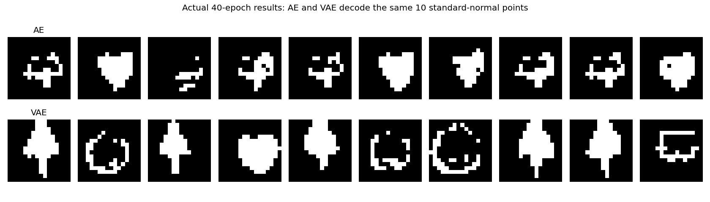

# Icon Generation: AE → VAE → Conditioned VAE

Three straightforward Google Colab lessons for teaching how an encoder and decoder become an image generator. Follow the lessons in this order.

| Order | Lesson | Open in Colab |
|---|---|---|
| 1 | **Autoencoder (AE) for icon generation** | [Open AE](https://colab.research.google.com/github/dujing82-blip/tiny-black-white-generative-ai/blob/main/01_AE_for_Icon_Generation.ipynb) |
| 2 | **Variational autoencoder (VAE) for icon generation** | [Open VAE](https://colab.research.google.com/github/dujing82-blip/tiny-black-white-generative-ai/blob/main/02_VAE_for_Icon_Generation.ipynb) |
| 3 | **Conditioned variational autoencoder (conditioned VAE) for icon generation** | [Open conditioned VAE](https://colab.research.google.com/github/dujing82-blip/tiny-black-white-generative-ai/blob/main/03_Conditioned_VAE_for_Icon_Generation.ipynb) |

Open a notebook and run its cells from top to bottom. A GPU runtime is helpful but not required. No pretrained model is used.

## What students learn

| | AE | VAE | Conditioned VAE |
|---|---|---|---|
| Encoder input | Image | Image | Image + word |
| Encoder result | Two deterministic coordinates | Two means, two log-variances, then sampled coordinates | Eight means and eight log-variances, then sampling with a word condition |
| Decoder input | z1, z2 | z1, z2 | Eight z values + word |
| Latent dimensions | 2 | 2 | 8 |
| Training loss | Reconstruction only | Reconstruction + KL | Reconstruction + KL |
| Explicit word control | No | No | Yes |
| Generation requires an input image | No | No | No |

All three lessons use **the same improved 10,000 black-and-white 16×16 icons**, the same CNN image paths, binary crossentropy summed over the 256 pixels, Adam at 0.001, batch size 128, and 40 epochs. The conditioned VAE adds word embeddings. Both VAE versions use beta = 1.0. AE and pure VAE use two dimensions for visualization; the conditioned VAE retains its previously validated eight dimensions for better detail. This is a teaching progression, not a controlled performance benchmark.

The coordinates typed into a decoder are **z1 and z2**. In a VAE, **mu1 and mu2** are the means predicted by the encoder for a particular image; decoding at z = mu is a deterministic reconstruction choice.

## Teaching the comparison honestly

A plain AE can decode coordinates it has never seen. It may generate recognizable icons near learned codes or between them, but it does not enforce a known distribution for random sampling. The AE lesson shows reconstruction, arbitrary coordinate entry, the actual encoded coordinates, a grid across their observed range, and a grid around zero.

A VAE adds sampling during training and KL regularization toward a standard normal prior. This makes standard-normal latent sampling more principled; it does not guarantee a clean icon at every point.

The conditioned VAE supplies the requested object explicitly through a word. A word condition helps control the icon family; it does not guarantee that the latent code contains no class information.

Use actual generated results when comparing quality. Do not assume that every AE sample must be worse than every VAE sample. A two-dimensional bottleneck is intentionally small for teaching and can produce mixed or imperfect shapes.

Below are actual AE and VAE outputs after 40 epochs, decoded from the same ten standard-normal coordinate pairs (seed 42). The AE has no standard-normal prior; this is a sampling experiment, not its reconstruction performance. Results can vary by hardware and training run.

## Pre-generated dataset

The notebooks download [data/icons_cnn_v2.npz](data/icons_cnn_v2.npz) directly from GitHub, verify its SHA256, and reuse a matching local copy. **No dataset generator runs in a classroom notebook.**

- 2,000 examples each: heart, face, robot, tree, spaceship.
- `images`: uint8 array `(10000, 16, 16)`, with pixels 0 or 255.
- `labels`: integer IDs in the word order above.
- `words`: the five names in label order.

The AE and pure VAE never receive labels or words as model inputs. Labels only color their post-training scatter plots. The conditioned VAE uses word IDs as model inputs.

Dataset provenance and checksum: [data/manifest_cnn_v2.json](data/manifest_cnn_v2.json). Maintainers can rebuild this archive with `python build_cnn_dataset.py`; if the archive changes, update the checksum in all three lesson notebooks.

The original dataset and dense conditional experiment remain in the repository for reference. Earlier pure-VAE and CNN-conditional notebook links point students to the newly named lessons.

## License

MIT License. Code and the procedurally generated teaching data may be reused for educational purposes.
